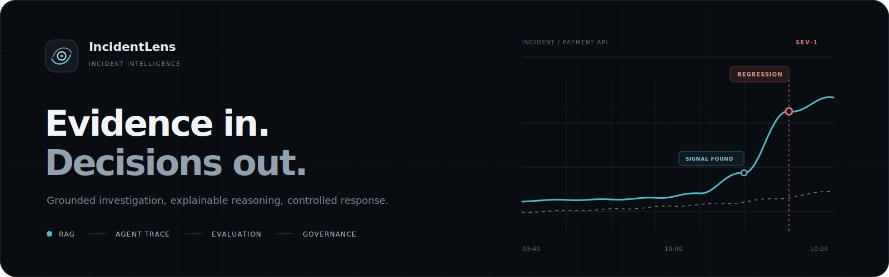
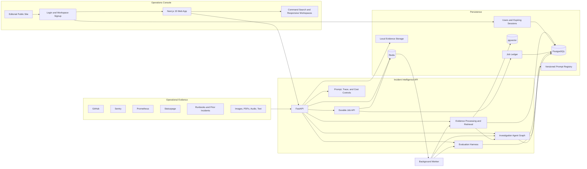
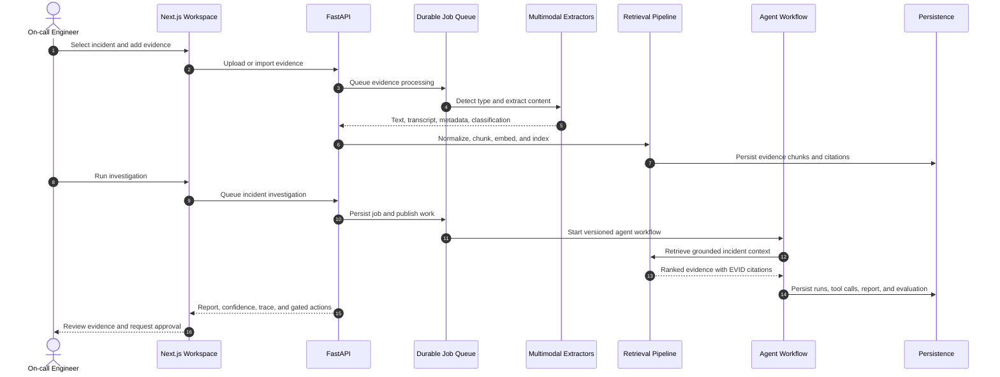
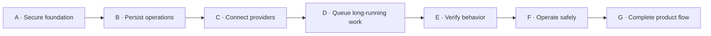
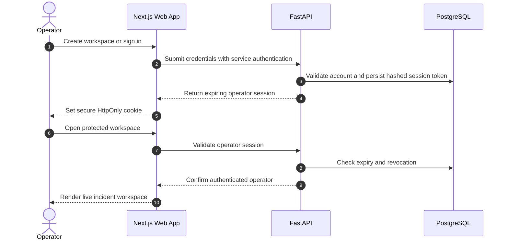
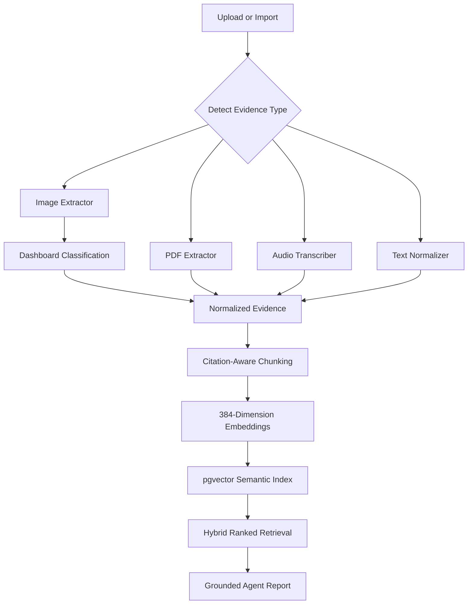
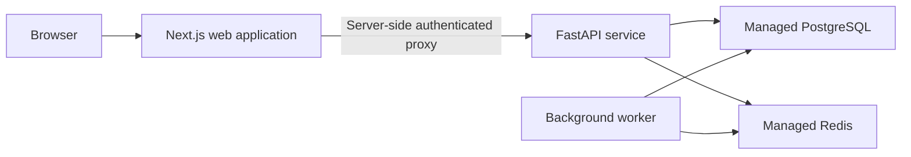

# IncidentLens

IncidentLens is an incident intelligence platform for Site Reliability Engineering teams. It combines multimodal evidence ingestion, evidence-grounded investigation, evaluation, and LLMOps visibility in one approval-aware workflow.

The Tracks A–G production scope is implemented. Runtime data is persisted, long-running work uses a durable queue, providers are credential-driven, and unavailable dependencies fail visibly instead of returning invented results. Test-only fakes and the versioned evaluation dataset never enter runtime workflows.

## Product Overview

IncidentLens turns fragmented operational signals into a grounded investigation report:

- collects evidence from logs, pull requests, metrics, runbooks, screenshots, PDFs, and voice notes
- normalizes, chunks, embeds, and retrieves evidence with stable citations
- orchestrates specialized agents for intake, retrieval, tool execution, root-cause analysis, remediation, and evaluation
- persists reports, agent runs, tool calls, latency, token use, and estimated cost
- keeps rollback, hotfix, feature-flag, and production mutation steps behind human approval
- measures retrieval quality, grounding, safety, latency, and regression risk

This is an incident workspace rather than a chatbot interface. The primary UX is designed for triage, evidence inspection, reasoning review, and controlled action.

## Delivery Status

| Track | Area | Completed implementation |
| --- | --- | --- |
| A | Security and schema | operator accounts, expiring web sessions, bearer service authentication, server-only proxy token, production validation, Alembic migrations |
| B | Operational workflows | incident CRUD, events, approvals, audit history, dashboard, and persisted runtime settings |
| C | Real providers | OpenAI-compatible models, embeddings, GitHub, Sentry, Prometheus, Statuspage, and runbooks |
| D | Durable execution | PostgreSQL job ledger, Redis queue, worker retries, idempotency, progress, and cancellation |
| E | Quality gates | backend tests, component tests, desktop/mobile browser tests, production build, and GitHub Actions |
| F | Operations | migration-first startup, API/worker/web containers, readiness checks, JSON logs, and runbook |
| G | Product completion | live-data UX, incident controls, responsive states, documentation, and removal of runtime fixtures |

## System Architecture



## Investigation Lifecycle



## Delivery Flow



## Frontend Experience

| Route | Purpose |
| --- | --- |
| `/` | public editorial product story, method, evidence narrative, human-control model, and calls to action |
| `/login` | protected operator login with an expiring server-backed session |
| `/signup` | workspace and operator account creation |
| `/dashboard` | incident command dashboard, active metrics, production readiness, and queue |
| `/incidents` | selectable incident triage with filters and a contextual summary rail |
| `/incidents/[id]` | investigation workspace with timeline, evidence, report, hypotheses, and gated actions |
| `/incidents/[id]/trace` | agent graph, run telemetry, expandable tool-call JSON, and report snapshot |
| `/evidence` | multimodal upload, connected-source import, processing state, chunks, and retrieval |
| `/evals` | evaluation history, quality metrics, regressions, and failed cases |
| `/settings` | model routing, embeddings, tracing, prompt versions, cost controls, and governance |

### Visual Direction

The public and authentication experience was rebuilt through an image-first design process. Generated page references established an editorial incident-observatory system rather than a conventional SaaS layout. The implemented UI uses:

- a custom generated optical evidence mark
- full-bleed incident observatory and evidence archive imagery
- asymmetric paper-plane authentication layouts instead of centered cards
- condensed editorial typography with a cyan causal thread and restrained orange decision controls
- a compact operational command rail after authentication

The production image assets live in `apps/web/public/brand` and `apps/web/public/visuals`. Public pages remain responsive, accessible, and separate from the authenticated operations shell.

### Authentication Flow



The frontend includes:

- responsive sheet navigation and keyboard command search
- desktop, tablet, and mobile investigation layouts
- selectable incident rows and service, severity, and status filters
- visible upload, extraction, chunking, embedding, and retrieval states
- approval-request state for production-changing recommendations
- designed loading, empty, failure, and no-result states
- explicit dependency and provider errors without fabricated runtime results

## Design System

[`DESIGN.md`](DESIGN.md) is the frontend source of truth. The visual system uses:

- Geist for interface typography and JetBrains Mono for operational data
- deep graphite surfaces with one mineral-cyan product accent
- semantic red, amber, and green reserved for incident state
- compact operational density and asymmetric workspace layouts
- double-bezel surfaces for major work areas
- transform and opacity motion with reduced-motion support
- accessible Radix-backed shadcn primitives for dialogs and mobile navigation

Original vector brand assets are stored in `apps/web/public/brand/`:

- `incidentlens-mark.svg`
- `incidentlens-wordmark.svg`
- `incidentlens-favicon.svg`

The interface intentionally excludes emojis, sparkle motifs, robot imagery, decorative chatbot patterns, neon glows, and purple AI gradients.

## Multimodal Evidence Pipeline

Supported evidence types:

| Category | Formats | Processing |
| --- | --- | --- |
| Images | `.png`, `.jpg`, `.jpeg`, `.webp` | visual extraction, dashboard classification, metadata, OCR-ready provider boundary |
| Documents | `.pdf`, `.md`, `.txt` | PDF or text extraction, validation, and normalization |
| Audio | `.mp3`, `.wav`, `.m4a` | credential-backed voice-note transcription through an OpenAI-compatible provider |
| Connected sources | GitHub, Sentry, Prometheus, Statuspage, runbooks | adapter import into the same evidence contract |



Uploaded files are stored under `apps/api/storage/evidence/` during local development. Runtime files are excluded from Git. The default upload limit is 25 MB and is configurable with `MAX_EVIDENCE_UPLOAD_BYTES`.

## Evaluation Methodology

The local evaluation harness measures:

- Recall@5 and Recall@10
- mean reciprocal rank
- root-cause accuracy
- citation coverage
- unsupported claim rate
- unsafe action rate
- average latency
- average estimated cost

The versioned evaluation dataset is located at `evals/datasets/payment_api_incident.json`. It is used only by the evaluation runner; runtime incidents are created through the UI or authenticated API. Evaluation runs are persisted and displayed in `/evals`.

## Technology Stack

| Layer | Technology |
| --- | --- |
| Frontend | Next.js 15, React 19, TypeScript, Tailwind CSS, shadcn-style Radix primitives |
| Backend | FastAPI, Pydantic, SQLAlchemy |
| Data | PostgreSQL, pgvector, Redis, durable evidence volume |
| Retrieval | normalization, citation-aware chunking, embeddings, semantic search, keyword fallback |
| Agent runtime | versioned prompts, primary/fallback provider routing, persisted runs and tool calls |
| Job runtime | PostgreSQL job ledger, Redis queue, dedicated worker, retries, cancellation, idempotency |
| Tooling | pnpm workspaces, Python virtual environment, Docker Compose, Makefile, pytest, Vitest, Playwright |

## Repository Structure

```text
IncidentLensAI/
├── apps/
│   ├── api/                     # FastAPI routes, models, services, agents, and job worker
│   └── web/                     # Next.js routes, components, brand assets, API client
├── config/                      # model and runtime configuration
├── docs/                        # architecture and subsystem design documents
├── evals/                       # datasets and local evaluation runner
├── packages/                    # shared workspace packages
├── prompts/                     # versioned agent prompt definitions
├── DESIGN.md                    # semantic UX and visual design system
├── docker-compose.yml
├── Makefile
└── README.md
```

## Local Development

### Prerequisites

- Node.js 20 or newer
- pnpm 9 or newer
- Python 3.11 or newer
- Docker Desktop for the containerized stack

### Install

```bash
git clone https://github.com/InsaneCoder789/IncidentLens.git
cd IncidentLens
make setup
cp .env.example .env
```

### Configure the runtime

```bash
openssl rand -hex 32
# Put the generated value in API_TOKEN and BACKEND_API_TOKEN in .env.
# Configure LLM_API_KEY and any operational integrations you intend to use.
make migrate
```

### Run locally

```bash
make dev
```

The frontend runs at `http://localhost:3000` and the API runs at `http://localhost:8000`.

Run services independently when needed:

```bash
make dev-web
make dev-api
```

### Run with Docker

```bash
make docker-up
```

Docker Compose starts PostgreSQL with pgvector, Redis, the migration-first API, the background worker, and the Next.js web application. The API is ready at `http://localhost:8000/api/health/ready` when both PostgreSQL and Redis are available.

Stop and remove local containers:

```bash
make docker-down
```

## Environment Configuration

| Variable | Default purpose |
| --- | --- |
| `DATABASE_URL` | PostgreSQL connection string |
| `REDIS_URL` | Redis connection string |
| `BACKEND_HOST` | FastAPI bind host |
| `BACKEND_PORT` | FastAPI port |
| `FRONTEND_PORT` | Next.js port |
| `NEXT_PUBLIC_API_URL` | browser-visible API base URL |
| `ENVIRONMENT` | runtime environment name |
| `API_TOKEN` | server-side bearer token required by protected FastAPI routes |
| `LLM_API_KEY` | credential for the configured OpenAI-compatible model, vision, and transcription APIs |
| `BACKEND_API_TOKEN` | matching server-only token used by the Next.js backend proxy |
| `EVIDENCE_STORAGE_DIR` | local evidence file directory |
| `MAX_EVIDENCE_UPLOAD_BYTES` | maximum accepted upload size |
| `JOB_QUEUE_NAME` | Redis queue used by the background worker |
| `JOB_MAX_ATTEMPTS` | maximum attempts for a failed durable job |
| `GITHUB_TOKEN`, `SENTRY_AUTH_TOKEN` | optional credentials for connected evidence sources |
| `PROMETHEUS_URL`, `STATUSPAGE_URL` | optional operational source endpoints |

Keep production credentials in the hosting provider's encrypted environment store. Do not place database URLs, Redis credentials, service tokens, or LLM keys in committed environment files.

## Production Deployment

IncidentLens AI is deployed as two independently scalable Vercel projects backed by managed PostgreSQL and Redis services.



The web project uses `apps/web` as its root directory and the API project uses `apps/api`. Set `API_URL` and `NEXT_PUBLIC_API_URL` to the API deployment URL, and configure matching `BACKEND_API_TOKEN` and `API_TOKEN` values as sensitive server-side variables. The API accepts either `DATABASE_URL` or the Vercel Marketplace `POSTGRES_URL` alias.

Apply database migrations before serving a new API release:

```bash
cd apps/api
alembic upgrade head
```

## API Workflows

### Incident management

```text
GET    /api/incidents
POST   /api/incidents
GET    /api/incidents/{incident_id}
PATCH  /api/incidents/{incident_id}
DELETE /api/incidents/{incident_id}
```

### Evidence and retrieval

```text
GET    /api/incidents/{incident_id}/evidence
POST   /api/incidents/{incident_id}/evidence
POST   /api/incidents/{incident_id}/evidence/upload
DELETE /api/evidence/{evidence_id}
GET    /api/evidence/{evidence_id}/file
POST   /api/evidence/{evidence_id}/process
POST   /api/incidents/{incident_id}/evidence/process-all
POST   /api/incidents/{incident_id}/evidence-jobs
GET    /api/incidents/{incident_id}/chunks
POST   /api/retrieval/search
```

### Investigation and telemetry

```text
POST /api/incidents/{incident_id}/investigation-jobs
GET  /api/jobs/{job_id}
POST /api/jobs/{job_id}/cancel
GET  /api/incidents/{incident_id}/report
GET  /api/incidents/{incident_id}/trace
```

### Integrations, evaluations, and LLMOps

```text
GET  /api/integrations/health
POST /api/integrations/{integration_key}/incidents/{incident_id}/import
GET  /api/evals/history
POST /api/evaluation-jobs
GET  /api/llmops/overview
GET  /api/settings
PATCH /api/settings
```

Interactive API documentation is available at `http://localhost:8000/docs` while the backend is running.

## Verification

Run the complete backend and frontend verification target:

```bash
make test
```

This executes:

- backend pytest coverage for authentication, incident operations, durable jobs, multimodal extraction, secure storage paths, retrieval, and report integration
- Vitest component coverage
- TypeScript type checking
- the optimized Next.js production build for all application routes

Run the desktop and mobile browser suite against running API and web services:

```bash
make test-e2e
```

Test retrieval manually:

```bash
curl -X POST http://localhost:8000/api/retrieval/search \
  -H "Authorization: Bearer $API_TOKEN" \
  -H "Content-Type: application/json" \
  -d '{
    "incident_id": 42,
    "query": "What signals explain this incident?",
    "top_k": 8,
    "score_threshold": 0.2
  }'
```

Test multimodal upload and retrieval:

```bash
curl -X POST http://localhost:8000/api/incidents/$INCIDENT_ID/evidence/upload \
  -H "Authorization: Bearer $API_TOKEN" \
  -F "file=@/absolute/path/to/grafana-payment-errors.png" \
  -F "title=Grafana payment error spike" \
  -F "description=Dashboard captured during the payment incident" \
  -F "process_immediately=false"

curl -X POST http://localhost:8000/api/incidents/$INCIDENT_ID/evidence-jobs \
  -H "Authorization: Bearer $API_TOKEN" \
  -H "Idempotency-Key: evidence-$INCIDENT_ID-$(date +%s)"
```

## Release Readiness

- runtime routes use persisted data rather than bundled incident fixtures
- the browser communicates through the authenticated Next.js backend proxy
- investigation, evidence, and evaluation work is queued and recorded in the job ledger
- startup applies database migrations before API traffic is accepted
- readiness checks cover PostgreSQL and Redis; liveness remains independent
- structured logs include request IDs, status codes, paths, and request duration
- GitHub Actions verifies migrations, backend tests, frontend tests, builds, and browser journeys
- external providers require real credentials and expose configuration failures clearly

## Evaluation Scenario

The versioned quality-assurance dataset models payment failures after release `v1.42.0`:

- service: `payments-api`
- leading root cause: webhook validation regression
- code signal: `PR #482` and `payments/webhook.py`
- runtime signal: `SignatureMismatchError`
- configuration signal: `payment_webhook_strict_mode`
- visual signal: Grafana error-rate and latency spike
- human signal: incident war-room voice note
- counter-evidence: payment provider status remains operational

The expected report selects the webhook validation regression, cites the supporting evidence, records missing evidence, and keeps rollback or feature-flag changes approval-gated.

## Product Walkthrough

1. Open `/` and review the production command dashboard.
2. Use `/incidents` to create an incident, assign an owner, and begin triage.
3. Open `/evidence`, import configured connected sources, and upload multimodal evidence.
4. Process the evidence in the durable job queue, then review ranked citations.
5. Open the incident workspace and run the persisted investigation job.
6. Review the report, root-cause confidence, missing evidence, and gated actions.
7. Open the incident trace and expand tool-call input and output JSON.
8. Run the versioned evaluation suite from `/evals`.
9. Review model, prompt, tracing, and governance controls in `/settings`.

## Security And Governance

- uploaded filenames are normalized and storage paths are validated against traversal
- upload size and file extension are validated before processing
- risky recommendations are surfaced but never automatically executed
- evidence citations remain attached to report claims
- model and prompt versions are visible in persisted traces
- missing providers fail visibly and never return fabricated successful data
- runtime uploads, environment files, and credentials are excluded from Git

## Documentation

| Document | Scope |
| --- | --- |
| [`DESIGN.md`](DESIGN.md) | semantic UX system, visual tokens, layout, motion, and anti-patterns |
| [`docs/architecture.md`](docs/architecture.md) | system architecture and service boundaries |
| [`docs/rag-design.md`](docs/rag-design.md) | normalization, chunking, embeddings, retrieval, and citations |
| [`docs/agent-design.md`](docs/agent-design.md) | agent responsibilities and orchestration |
| [`docs/eval-design.md`](docs/eval-design.md) | datasets, metrics, execution, and regression analysis |
| [`docs/llmops.md`](docs/llmops.md) | model routing, prompts, tracing, latency, tokens, and cost |
| [`docs/multimodal-design.md`](docs/multimodal-design.md) | Phase 7 extraction, storage, retrieval, and frontend behavior |
| [`docs/operations-runbook.md`](docs/operations-runbook.md) | release, rollback, database, queue, and provider recovery procedures |
