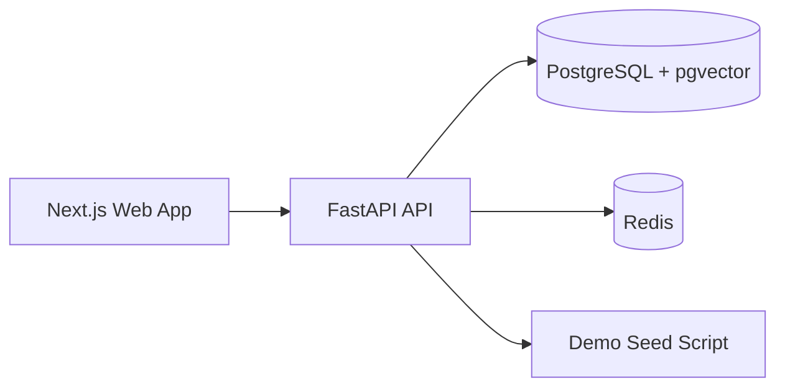
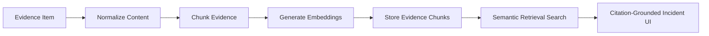

# IncidentLens AI

IncidentLens AI is a production-grade multimodal AI SRE copilot that combines RAG, multi-agent orchestration, LLM evaluation, and LLMOps to investigate production incidents using logs, GitHub changes, Sentry traces, runbooks, metrics, and dashboard screenshots.

The frontend implementation is rebuilt from the Stitch UI prototype and screens, which serve as the visual source of truth for layout, spacing, hierarchy, and dashboard composition.

## Overview

IncidentLens AI is a portfolio-ready incident intelligence platform for SREs, DevOps engineers, platform engineers, and engineering managers. The Phase 1 foundation includes:

- a FastAPI backend with incident and evidence CRUD
- PostgreSQL-ready persistence with pgvector support
- a Next.js App Router frontend
- a dark-mode engineering dashboard
- a seeded production-style incident
- local mock data so the UI works before AI integrations are added

## Why this matters

Production incident response is noisy, high-stakes, and evidence-heavy. IncidentLens AI demonstrates how to combine retrieval, reasoning, traces, and operational context into a credible incident workflow rather than a toy chatbot.

## Tech Stack

- Frontend: Next.js, TypeScript, Tailwind CSS, shadcn/ui-style primitives
- Backend: FastAPI, SQLAlchemy, PostgreSQL, pgvector, Redis-ready config
- DevEx: Docker Compose, pnpm workspaces, Makefile

## Phase 2 Features

- dashboard, incident list, incident detail workspace, evidence workspace, trace viewer, eval dashboard, and LLMOps settings screens rebuilt from the Stitch UI prototype
- evidence processing pipeline with normalization, chunking, embeddings, chunk storage, and incident-wide citation numbering
- semantic retrieval search with vector-first matching and keyword fallback
- incident and evidence APIs ready for the FastAPI backend contracts
- realistic seeded payment incident data for retrieval and investigation flows

## Architecture



## RAG Pipeline



## Local Setup

1. Copy `.env.example` to `.env`.
2. Start the database stack.
3. Run the backend and frontend dev servers.
4. Seed the demo incident.

### Docker

```bash
docker compose up --build
```

### Backend

```bash
cd apps/api
python -m pip install -r requirements.txt
uvicorn app.main:app --reload --host 0.0.0.0 --port 8000
```

### Frontend

```bash
cd apps/web
pnpm install
pnpm dev
```

### Seed data

```bash
cd apps/api
python3 -m app.seed.demo
```

## Environment Variables

- `DATABASE_URL`
- `REDIS_URL`
- `BACKEND_HOST`
- `BACKEND_PORT`
- `NEXT_PUBLIC_API_URL`
- `MOCK_MODE`

## Demo Scenario

The seeded incident is:

- Title: Payment API failures after webhook deployment
- Severity: high
- Status: investigating
- Service: `payments-api`

## API Reference

- `GET /api/health`
- `GET /api/incidents`
- `POST /api/incidents`
- `GET /api/incidents/{incident_id}`
- `PATCH /api/incidents/{incident_id}`
- `DELETE /api/incidents/{incident_id}`
- `GET /api/incidents/{incident_id}/evidence`
- `POST /api/incidents/{incident_id}/evidence`
- `POST /api/incidents/{incident_id}/evidence/process-all`
- `GET /api/incidents/{incident_id}/chunks`
- `POST /api/evidence/{evidence_id}/process`
- `POST /api/retrieval/search`
- `DELETE /api/evidence/{evidence_id}`

## Frontend Screenshots

Placeholder for dashboard and incident workspace screenshots.

## Resume-Ready Impact

Built IncidentLens AI, a multimodal AI SRE platform using FastAPI, Next.js, LangGraph, PostgreSQL, pgvector, and HuggingFace embeddings to investigate production incidents across logs, GitHub changes, Sentry errors, runbooks, and dashboard screenshots.
Designed a hybrid RAG pipeline with chunking, semantic search, metadata filtering, reranking, and citation-grounded generation for incident evidence retrieval.
Implemented a multi-agent investigation workflow with intake, retrieval, root-cause, remediation, and evaluator agents, producing structured incident reports with confidence scores and evidence citations.
Built an LLM evaluation harness measuring Recall@5, root cause accuracy, citation coverage, unsupported claim rate, unsafe recommendation rate, latency, and estimated cost per incident.
Added LLMOps features including prompt versioning, model routing, agent traces, latency tracking, cost monitoring, fallback models, and eval regression tests.

## Future Roadmap

- RAG ingestion and evidence chunking
- multi-agent investigation flow
- trace viewer and eval dashboard
- integration adapters for GitHub, Sentry, Prometheus, and Statuspage
