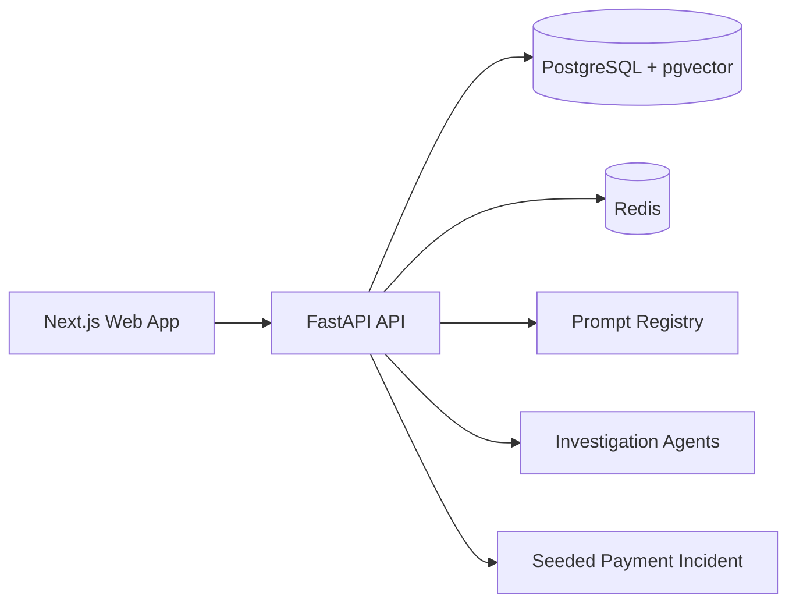
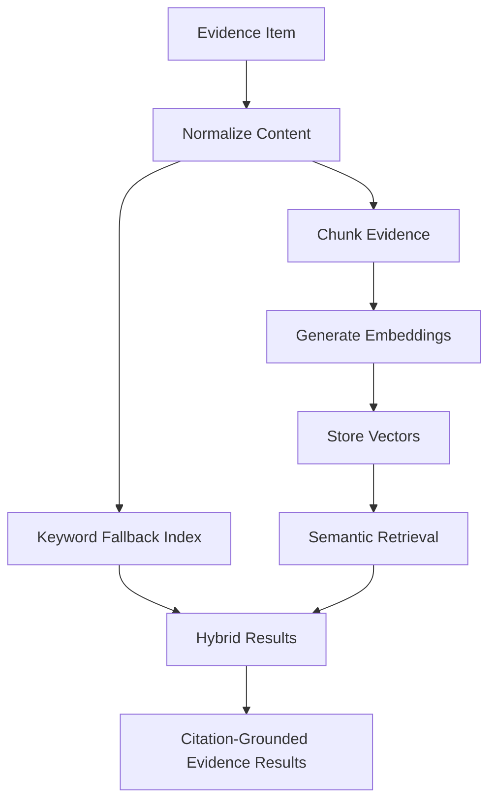
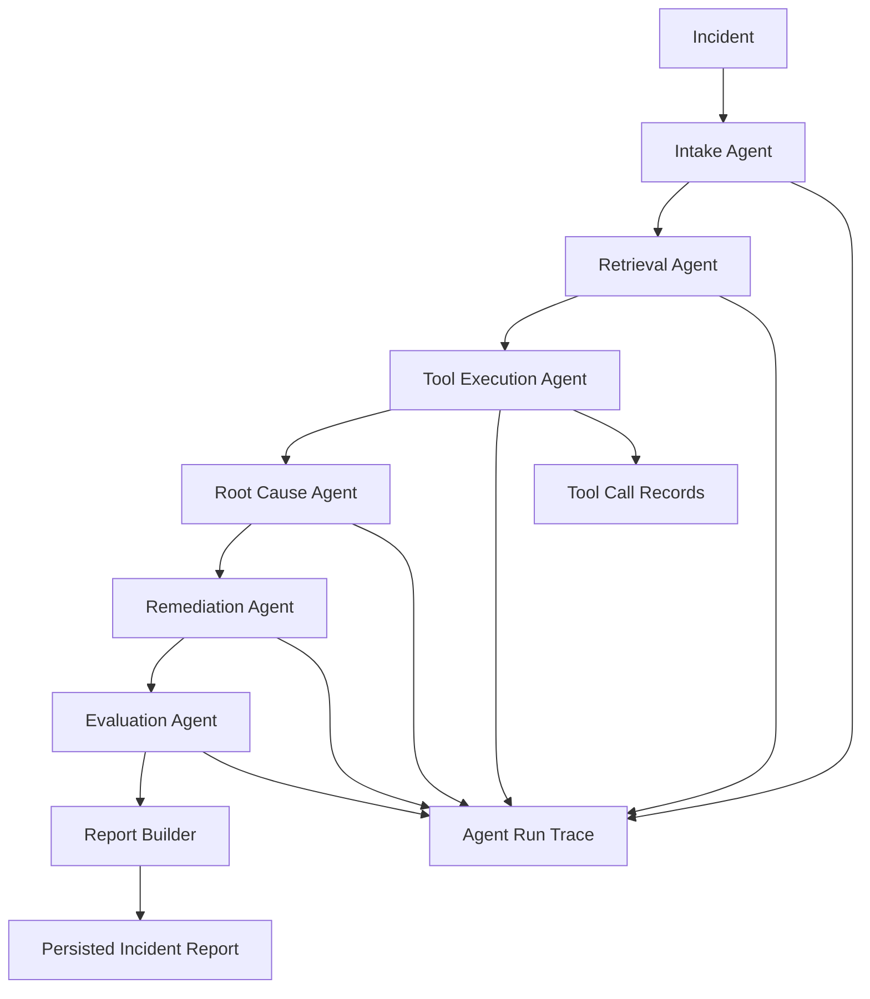

# IncidentLens AI

IncidentLens AI is a production-style multimodal AI SRE copilot for investigating incidents with grounded evidence, multi-agent workflows, and LLMOps visibility.

The frontend is implemented from the Stitch UI prototype and screens as the visual source of truth. The current web app intentionally follows the Stitch layout, spacing, hierarchy, dark-mode styling, and workspace composition while keeping the codebase clean, typed, reusable, and backend-ready.

## What’s In The Repo Today

This repository currently includes:

- a `pnpm` monorepo with `apps/web`, `apps/api`, and `packages/shared`
- a Next.js App Router frontend for dashboard, incidents, evidence, trace, evals, and settings
- a FastAPI backend with incident, evidence, retrieval, and investigation endpoints
- a Phase 2 RAG pipeline with normalization, chunking, embeddings, and hybrid retrieval
- a Phase 3 multi-agent investigation workflow with persisted reports and traces
- seeded payment incident data for realistic local demos
- docs for architecture, RAG, agents, evals, and LLMOps

## Product Positioning

This is not a chatbot wrapper. IncidentLens AI is designed as a serious internal engineering platform for:

- Site Reliability Engineers
- DevOps engineers
- platform teams
- backend engineers
- engineering managers
- recruiters and hiring managers reviewing applied AI portfolios

It demonstrates how AI can support production incident response while staying grounded in operational evidence and explicit approval boundaries.

## Tech Stack

- Frontend: Next.js 15, React 19, TypeScript, Tailwind CSS, shadcn-style UI primitives
- Backend: FastAPI, SQLAlchemy, PostgreSQL, pgvector, Redis
- AI and retrieval: evidence normalization, chunking, embeddings, vector retrieval, keyword fallback, deterministic mock mode
- DevEx: `pnpm` workspaces, Docker Compose, Makefile, seeded demo flow

## Implemented Product Surfaces

The current frontend includes these routes:

- `/` dashboard
- `/incidents` incident list and queue
- `/incidents/[id]` investigation workspace
- `/incidents/[id]/trace` agent trace viewer
- `/evidence` evidence workspace
- `/evals` evaluation dashboard
- `/settings` LLMOps and model settings

Key UI components already present in the codebase include:

- `AppShell`, `Sidebar`, `Topbar`
- `MetricCard`, `SeverityBadge`, `StatusBadge`
- `IncidentTable`, `IncidentTimeline`
- `EvidenceCard`, `EvidenceCitation`, `ConfidenceGauge`

## Monorepo Layout

```text
IncidentLensAI/
├── apps/
│   ├── api/        # FastAPI backend, agents, retrieval, models, seed flow
│   └── web/        # Next.js frontend rebuilt from Stitch reference screens
├── config/         # model and runtime configuration
├── docs/           # architecture, RAG, agents, evals, LLMOps docs
├── evals/          # evaluation harness assets
├── packages/       # shared workspace packages
├── prompts/        # versioned prompt definitions for agent steps
├── docker-compose.yml
├── Makefile
└── README.md
```

## System Architecture



## Evidence And Retrieval Flow



### Retrieval Notes

- Embedding model target: `sentence-transformers/all-MiniLM-L6-v2`
- Fallback path: deterministic 384-dimension embeddings when the local model is unavailable
- Citation style: `EVID-001`, `EVID-002`, `EVID-003`
- Processing routes:
  - `POST /api/evidence/{evidence_id}/process`
  - `POST /api/incidents/{incident_id}/evidence/process-all`
- Retrieval route:
  - `POST /api/retrieval/search`

## Investigation Workflow



### Investigation Notes

- mock LLM mode is enabled by default for deterministic local demos
- reports are persisted and rendered with evidence citations
- trace data captures agent runs, prompt versions, model names, latency, and token counts
- risky remediation steps remain approval-gated and are never auto-executed
- investigation routes:
  - `POST /api/incidents/{incident_id}/investigate`
  - `GET /api/incidents/{incident_id}/report`
  - `GET /api/incidents/{incident_id}/trace`

## Demo Scenario

The seeded incident models a realistic payment outage:

- Title: `Payment API failures after webhook deployment`
- Severity: `high`
- Status: `investigating`
- Service: `payments-api`

Expected evidence and retrieval results reference items like `PR #482`, `SignatureMismatchError`, `payments/webhook.py`, `v1.42.0`, `payment_webhook_strict_mode`, Prometheus error spikes, and `INC-104`.

## Local Development

### 1. Install dependencies

```bash
pnpm install
python3 -m pip install -r apps/api/requirements.txt
```

### 2. Create environment config

```bash
cp .env.example .env
```

Current env variables:

- `DATABASE_URL`
- `REDIS_URL`
- `BACKEND_HOST`
- `BACKEND_PORT`
- `FRONTEND_PORT`
- `NEXT_PUBLIC_API_URL`
- `ENVIRONMENT`
- `MOCK_MODE`

### 3. Start with Docker

```bash
docker compose up --build
```

### 4. Or run locally with Make

```bash
make dev
```

Useful targets:

- `make setup`
- `make dev`
- `make dev-web`
- `make dev-api`
- `make seed`
- `make docker-up`
- `make docker-down`

### 5. Run services manually

Backend:

```bash
cd apps/api
uvicorn app.main:app --reload --host 0.0.0.0 --port 8000
```

Frontend:

```bash
cd apps/web
pnpm dev
```

## API Surface

- `GET /`
- `GET /api/health`
- `GET /api/incidents`
- `POST /api/incidents`
- `GET /api/incidents/{incident_id}`
- `PATCH /api/incidents/{incident_id}`
- `DELETE /api/incidents/{incident_id}`
- `GET /api/incidents/{incident_id}/evidence`
- `POST /api/incidents/{incident_id}/evidence`
- `DELETE /api/evidence/{evidence_id}`
- `POST /api/evidence/{evidence_id}/process`
- `POST /api/incidents/{incident_id}/evidence/process-all`
- `GET /api/incidents/{incident_id}/chunks`
- `POST /api/retrieval/search`
- `POST /api/incidents/{incident_id}/investigate`
- `GET /api/incidents/{incident_id}/report`
- `GET /api/incidents/{incident_id}/trace`

## Quick Verification

### Test retrieval locally

```bash
make setup
make seed
make dev
curl -X POST http://localhost:8000/api/incidents/1/evidence/process-all
curl -X POST http://localhost:8000/api/retrieval/search \
  -H "Content-Type: application/json" \
  -d '{
    "incident_id": 1,
    "query": "What caused the payment API failure?",
    "top_k": 8
  }'
```

### Test investigation locally

```bash
make seed
make dev
curl -X POST http://localhost:8000/api/incidents/1/evidence/process-all
curl -X POST http://localhost:8000/api/incidents/1/investigate
curl http://localhost:8000/api/incidents/1/report
curl http://localhost:8000/api/incidents/1/trace
```

## Documentation

Additional project notes live in:

- `docs/architecture.md`
- `docs/rag-design.md`
- `docs/agent-design.md`
- `docs/eval-design.md`
- `docs/llmops.md`

## Expected Investigation Outcome

For the seeded incident, the current investigation flow should converge on:

- root cause: `Webhook validation regression`
- grounded citations across `PR #482`, `SignatureMismatchError`, `payments/webhook.py`, `v1.42.0`, `payment_webhook_strict_mode`, `INC-104`, and statuspage evidence
- approval-gated handling for risky actions
- persisted trace output with agent runs and tool calls

## Portfolio Value

This project currently demonstrates:

- serious AI product framing beyond chat UX
- a Stitch-aligned frontend rebuilt as production-grade React code
- RAG over operational evidence instead of toy document retrieval
- multi-step investigation orchestration with persisted traces and reports
- LLMOps-oriented thinking around prompt versions, costs, latency, and evaluation surfaces

## Future Roadmap

- real provider integrations beyond deterministic mock mode
- deeper adapters for GitHub, Sentry, Prometheus, and Statuspage
- broader eval datasets and regression automation
- richer evidence ingestion for screenshots, documents, and multimodal workflows

## Current Status

The repository currently reflects:

- Phase 2 Stitch-aligned frontend and RAG workflow work
- Phase 2 retrieval verification and seeded evidence improvements
- Phase 3 multi-agent investigation, trace persistence, report generation, and mock model routing

This README is intentionally aligned with the code as it exists now, including the Stitch-based frontend direction and the current backend integration surface.
