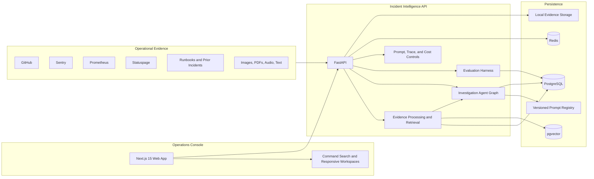
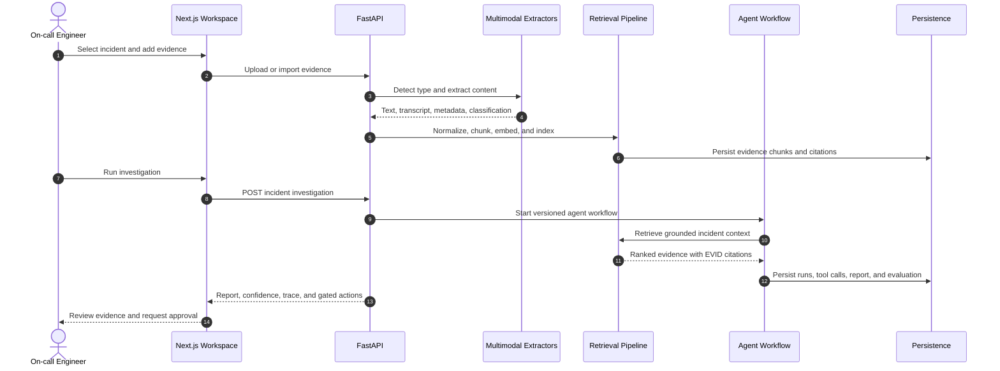
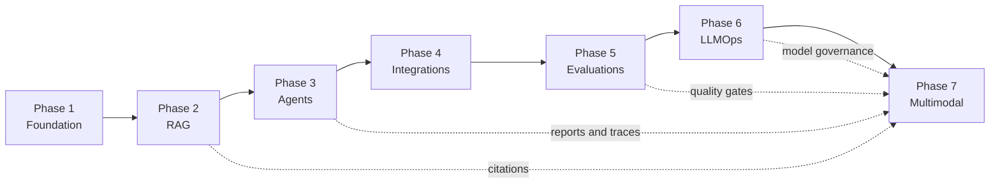
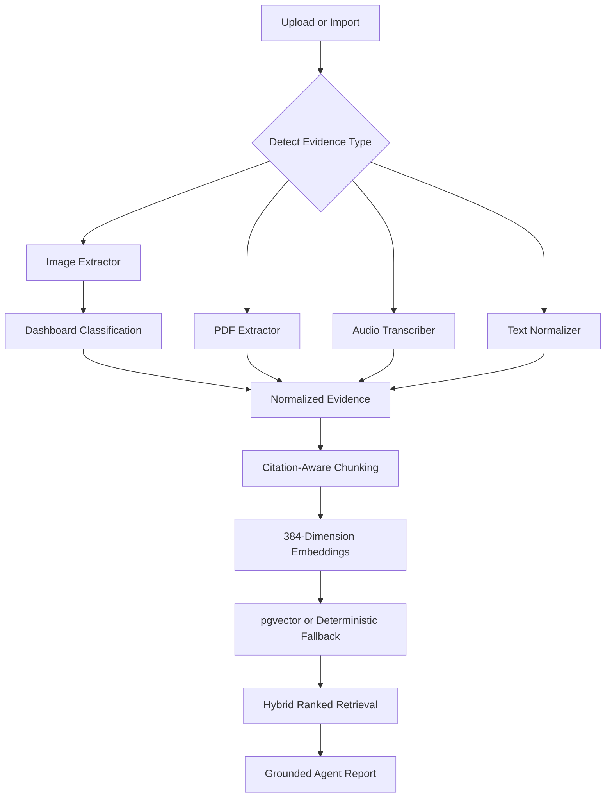

# IncidentLens AI

IncidentLens AI is a production-style incident intelligence platform for Site Reliability Engineering teams. It combines multimodal evidence ingestion, retrieval-augmented generation, multi-agent investigation, evaluation, and LLMOps visibility in one approval-aware workflow.

The repository is complete through Phase 7 and runs locally in deterministic mock mode without paid model APIs.

## Product Overview

IncidentLens turns fragmented operational signals into a grounded investigation report:

- collects evidence from logs, pull requests, metrics, runbooks, screenshots, PDFs, and voice notes
- normalizes, chunks, embeds, and retrieves evidence with stable citations
- orchestrates specialized agents for intake, retrieval, tool execution, root-cause analysis, remediation, and evaluation
- persists reports, agent runs, tool calls, latency, token use, and estimated cost
- keeps rollback, hotfix, feature-flag, and production mutation steps behind human approval
- measures retrieval quality, grounding, safety, latency, and regression risk

This is an incident workspace rather than a chatbot interface. The primary UX is designed for triage, evidence inspection, reasoning review, and controlled action.

## Current Capabilities

| Phase | Capability | Implementation |
| --- | --- | --- |
| 1 | Product foundation | Next.js application shell, incident dashboard, FastAPI service, seeded incident data |
| 2 | Retrieval pipeline | normalization, chunking, embeddings, keyword fallback, pgvector-ready semantic retrieval |
| 3 | Investigation agents | persisted multi-agent orchestration, report generation, citations, traces, tool calls |
| 4 | Production adapters | mock GitHub, Sentry, Prometheus, Statuspage, runbook, and prior-incident imports |
| 5 | Evaluation | local dataset runner, history API, quality metrics, failed-case inspection |
| 6 | LLMOps | model routing, prompt versions, tracing, latency, tokens, cost, runtime settings |
| 7 | Multimodal evidence | screenshots, architecture diagrams, PDFs, text documents, and voice notes |

## System Architecture



## Investigation Lifecycle



## Phase Progression



## Frontend Experience

| Route | Purpose |
| --- | --- |
| `/` | incident command dashboard, active metrics, production readiness, and queue |
| `/incidents` | selectable incident triage with filters and a contextual summary rail |
| `/incidents/[id]` | investigation workspace with timeline, evidence, report, hypotheses, and gated actions |
| `/incidents/[id]/trace` | agent graph, run telemetry, expandable tool-call JSON, and report snapshot |
| `/evidence` | multimodal upload, connected-source import, processing state, chunks, and retrieval |
| `/evals` | evaluation history, quality metrics, regressions, and failed cases |
| `/settings` | model routing, embeddings, tracing, prompt versions, cost controls, and governance |

The frontend includes:

- responsive sheet navigation and keyboard command search
- desktop, tablet, and mobile investigation layouts
- selectable incident rows and service, severity, and status filters
- visible upload, extraction, chunking, embedding, and retrieval states
- approval-request state for production-changing recommendations
- designed loading, empty, failure, and no-result states
- deterministic API fallbacks that keep the local demo usable

## Design System

[`DESIGN.md`](DESIGN.md) is the frontend source of truth. The visual system uses:

- Geist for interface typography and JetBrains Mono for operational data
- deep graphite surfaces with one mineral-cyan product accent
- semantic red, amber, and green reserved for incident state
- compact operational density and asymmetric workspace layouts
- double-bezel surfaces for major work areas
- transform and opacity motion with reduced-motion support
- accessible Radix-backed shadcn primitives for dialogs and mobile navigation

Original vector brand assets are stored in `apps/web/public/brand/`:

- `incidentlens-mark.svg`
- `incidentlens-wordmark.svg`
- `incidentlens-favicon.svg`

The interface intentionally excludes emojis, sparkle motifs, robot imagery, decorative chatbot patterns, neon glows, and purple AI gradients.

## Multimodal Evidence Pipeline

Supported evidence types:

| Category | Formats | Processing |
| --- | --- | --- |
| Images | `.png`, `.jpg`, `.jpeg`, `.webp` | visual extraction, dashboard classification, metadata, OCR-ready provider boundary |
| Documents | `.pdf`, `.md`, `.txt` | PDF or text extraction, safe fallback, normalization |
| Audio | `.mp3`, `.wav`, `.m4a` | deterministic voice-note transcription through a swappable provider |
| Connected sources | GitHub, Sentry, Prometheus, Statuspage, runbooks | adapter import into the same evidence contract |



Uploaded files are stored under `apps/api/storage/evidence/` during local development. Runtime files are excluded from Git. The default upload limit is 25 MB and is configurable with `MAX_EVIDENCE_UPLOAD_BYTES`.

## Evaluation Methodology

The local evaluation harness measures:

- Recall@5 and Recall@10
- mean reciprocal rank
- root-cause accuracy
- citation coverage
- unsupported claim rate
- unsafe action rate
- average latency
- average estimated cost

The seeded dataset is located at `evals/datasets/payment_api_incident.json`. Evaluation runs are persisted and displayed in `/evals`.

## Technology Stack

| Layer | Technology |
| --- | --- |
| Frontend | Next.js 15, React 19, TypeScript, Tailwind CSS, shadcn-style Radix primitives |
| Backend | FastAPI, Pydantic, SQLAlchemy |
| Data | PostgreSQL, pgvector, Redis, local evidence storage |
| Retrieval | normalization, citation-aware chunking, embeddings, semantic search, keyword fallback |
| Agent runtime | versioned prompts, deterministic mock model routing, persisted runs and tool calls |
| Tooling | pnpm workspaces, Python virtual environment, Docker Compose, Makefile, pytest |

## Repository Structure

```text
IncidentLensAI/
├── apps/
│   ├── api/                     # FastAPI routes, models, services, agents, seed data
│   └── web/                     # Next.js routes, components, brand assets, API client
├── config/                      # model and runtime configuration
├── docs/                        # architecture and subsystem design documents
├── evals/                       # datasets and local evaluation runner
├── packages/                    # shared workspace packages
├── prompts/                     # versioned agent prompt definitions
├── DESIGN.md                    # semantic UX and visual design system
├── docker-compose.yml
├── Makefile
└── README.md
```

## Local Development

### Prerequisites

- Node.js 20 or newer
- pnpm 9 or newer
- Python 3.11 or newer
- Docker Desktop for the containerized stack

### Install

```bash
git clone https://github.com/InsaneCoder789/IncidentLensAI.git
cd IncidentLensAI
make setup
cp .env.example .env
```

### Seed the demo incident

```bash
make seed
```

### Run locally

```bash
make dev
```

The frontend runs at `http://localhost:3000` and the API runs at `http://localhost:8000`.

Run services independently when needed:

```bash
make dev-web
make dev-api
```

### Run with Docker

```bash
make docker-up
```

Stop and remove local containers:

```bash
make docker-down
```

## Environment Configuration

| Variable | Default purpose |
| --- | --- |
| `DATABASE_URL` | PostgreSQL connection string |
| `REDIS_URL` | Redis connection string |
| `BACKEND_HOST` | FastAPI bind host |
| `BACKEND_PORT` | FastAPI port |
| `FRONTEND_PORT` | Next.js port |
| `NEXT_PUBLIC_API_URL` | browser-visible API base URL |
| `ENVIRONMENT` | runtime environment name |
| `MOCK_MODE` | deterministic local model and integration behavior |
| `EVIDENCE_STORAGE_DIR` | local evidence file directory |
| `MAX_EVIDENCE_UPLOAD_BYTES` | maximum accepted upload size |

## API Workflows

### Incident management

```text
GET    /api/incidents
POST   /api/incidents
GET    /api/incidents/{incident_id}
PATCH  /api/incidents/{incident_id}
DELETE /api/incidents/{incident_id}
```

### Evidence and retrieval

```text
GET    /api/incidents/{incident_id}/evidence
POST   /api/incidents/{incident_id}/evidence
POST   /api/incidents/{incident_id}/evidence/upload
DELETE /api/evidence/{evidence_id}
GET    /api/evidence/{evidence_id}/file
POST   /api/evidence/{evidence_id}/process
POST   /api/incidents/{incident_id}/evidence/process-all
GET    /api/incidents/{incident_id}/chunks
POST   /api/retrieval/search
```

### Investigation and telemetry

```text
POST /api/incidents/{incident_id}/investigate
GET  /api/incidents/{incident_id}/report
GET  /api/incidents/{incident_id}/trace
```

### Integrations, evaluations, and LLMOps

```text
GET  /api/integrations/health
POST /api/integrations/{integration_key}/incidents/{incident_id}/import
GET  /api/evals/history
POST /api/evals/run
GET  /api/llmops/overview
```

Interactive API documentation is available at `http://localhost:8000/docs` while the backend is running.

## Verification

Run the complete backend and frontend verification target:

```bash
make test
```

This executes:

- backend pytest coverage for multimodal classification, extraction fallback, secure storage paths, upload, retrieval, and report integration
- TypeScript type checking
- the optimized Next.js production build for all application routes

Test retrieval manually:

```bash
curl -X POST http://localhost:8000/api/retrieval/search \
  -H "Content-Type: application/json" \
  -d '{
    "incident_id": 1,
    "query": "What caused the payment API failure?",
    "top_k": 8,
    "score_threshold": 0.2
  }'
```

Test multimodal upload and retrieval:

```bash
curl -X POST http://localhost:8000/api/incidents/1/evidence/upload \
  -F "file=@/absolute/path/to/grafana-payment-errors.png" \
  -F "title=Grafana payment error spike" \
  -F "description=Dashboard captured during the payment incident" \
  -F "process_immediately=true"
```

## Demo Scenario

The seeded scenario models payment failures after release `v1.42.0`:

- service: `payments-api`
- leading root cause: webhook validation regression
- code signal: `PR #482` and `payments/webhook.py`
- runtime signal: `SignatureMismatchError`
- configuration signal: `payment_webhook_strict_mode`
- visual signal: Grafana error-rate and latency spike
- human signal: incident war-room voice note
- counter-evidence: payment provider status remains operational

The expected report selects the webhook validation regression, cites the supporting evidence, records missing evidence, and keeps rollback or feature-flag changes approval-gated.

## Demo Walkthrough

1. Open `/` and review the production command dashboard.
2. Use `/incidents` to select and triage the seeded payment incident.
3. Open `/evidence`, import connected sources, and upload multimodal evidence.
4. Search the indexed chunks and review ranked citations.
5. Open `/incidents/1` and run the persisted investigation workflow.
6. Review the report, root-cause confidence, missing evidence, and gated actions.
7. Open `/incidents/1/trace` and expand tool-call input and output JSON.
8. Run the evaluation suite from `/evals`.
9. Review model, prompt, tracing, and governance controls in `/settings`.

## Security And Governance

- uploaded filenames are normalized and storage paths are validated against traversal
- upload size and file extension are validated before processing
- risky recommendations are surfaced but never automatically executed
- evidence citations remain attached to report claims
- model and prompt versions are visible in persisted traces
- mock mode is enabled by default for safe local operation
- runtime uploads, environment files, and credentials are excluded from Git

## Documentation

| Document | Scope |
| --- | --- |
| [`DESIGN.md`](DESIGN.md) | semantic UX system, visual tokens, layout, motion, and anti-patterns |
| [`docs/architecture.md`](docs/architecture.md) | system architecture and service boundaries |
| [`docs/rag-design.md`](docs/rag-design.md) | normalization, chunking, embeddings, retrieval, and citations |
| [`docs/agent-design.md`](docs/agent-design.md) | agent responsibilities and orchestration |
| [`docs/eval-design.md`](docs/eval-design.md) | datasets, metrics, execution, and regression analysis |
| [`docs/llmops.md`](docs/llmops.md) | model routing, prompts, tracing, latency, tokens, and cost |
| [`docs/multimodal-design.md`](docs/multimodal-design.md) | Phase 7 extraction, storage, retrieval, and frontend behavior |

## Project Status

Phase 7 is implemented and verified. The current repository includes the production-style frontend, FastAPI contracts, deterministic local data and model paths, multimodal retrieval, persisted agent reports and traces, evaluation history, and LLMOps controls described above.
