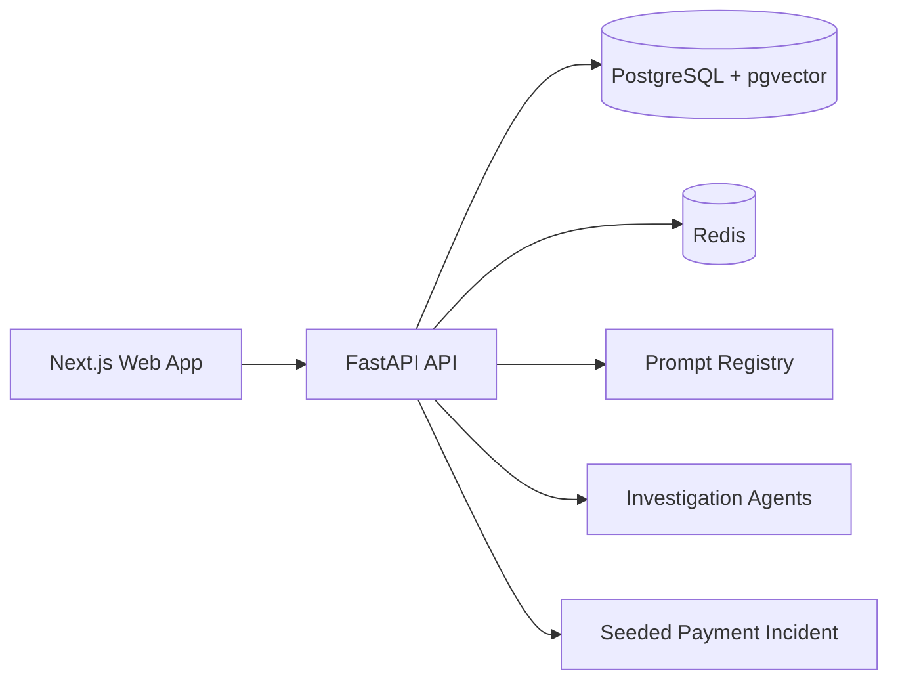
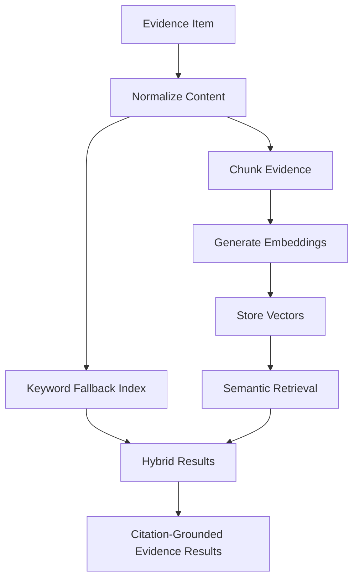
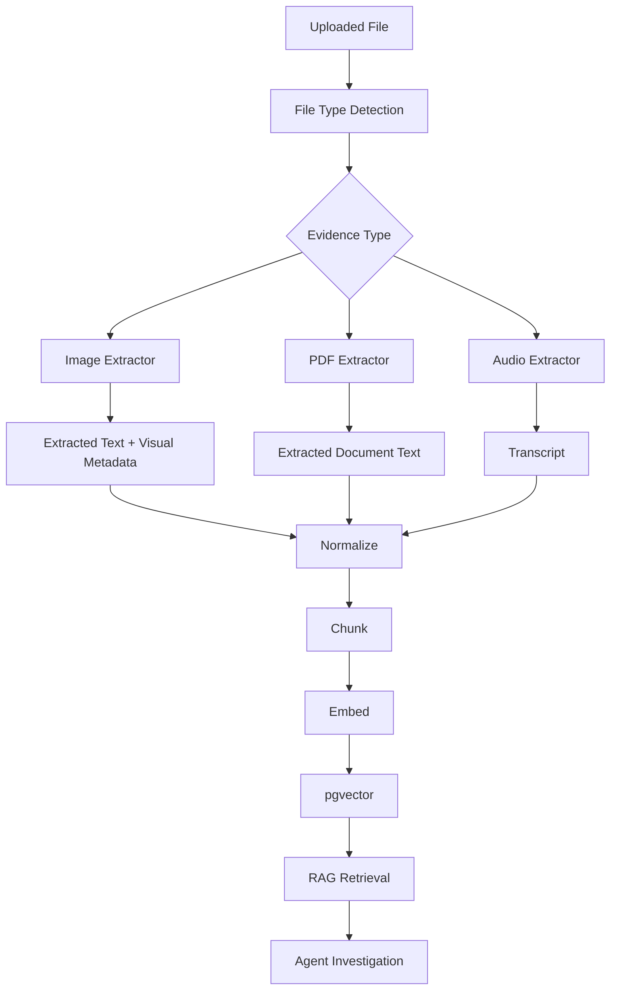
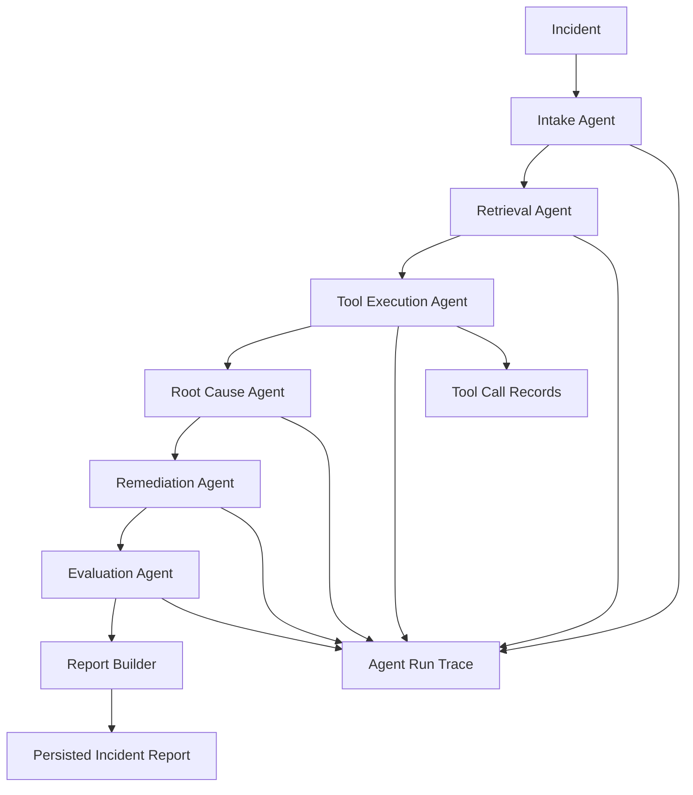

# IncidentLens AI

IncidentLens AI is a production-style multimodal AI SRE copilot for investigating incidents with grounded evidence, multi-agent workflows, and LLMOps visibility.

The frontend is implemented from the Stitch UI prototype and screens as the visual source of truth. The current web app intentionally follows the Stitch layout, spacing, hierarchy, dark-mode styling, and workspace composition while keeping the codebase clean, typed, reusable, and backend-ready.

## What’s In The Repo Today

This repository currently includes:

- a `pnpm` monorepo with `apps/web`, `apps/api`, and `packages/shared`
- a Next.js App Router frontend for dashboard, incidents, evidence, trace, evals, and settings
- a FastAPI backend with incident, evidence, retrieval, and investigation endpoints
- a Phase 2 RAG pipeline with normalization, chunking, embeddings, and hybrid retrieval
- a Phase 3 multi-agent investigation workflow with persisted reports and traces
- a Phase 4 mock integration layer for GitHub, Sentry, Prometheus, Statuspage, and runbook evidence import
- a Phase 5 local eval harness with CLI, API, persistence, and dashboard history
- a Phase 6 LLMOps surface for prompt versions, model routing, latency, token usage, and cost visibility
- a Phase 7 multimodal pipeline for screenshots, PDFs, text documents, and voice notes
- seeded payment incident data for realistic local demos
- docs for architecture, RAG, agents, evals, LLMOps, and multimodal evidence

## Product Positioning

This is not a chatbot wrapper. IncidentLens AI is designed as a serious internal engineering platform for:

- Site Reliability Engineers
- DevOps engineers
- platform teams
- backend engineers
- engineering managers
- recruiters and hiring managers reviewing applied AI portfolios

It demonstrates how AI can support production incident response while staying grounded in operational evidence and explicit approval boundaries.

## Tech Stack

- Frontend: Next.js 15, React 19, TypeScript, Tailwind CSS, shadcn-style UI primitives
- Backend: FastAPI, SQLAlchemy, PostgreSQL, pgvector, Redis
- AI and retrieval: evidence normalization, chunking, embeddings, vector retrieval, keyword fallback, deterministic mock mode
- DevEx: `pnpm` workspaces, Docker Compose, Makefile, seeded demo flow

## Implemented Product Surfaces

The current frontend includes these routes:

- `/` dashboard
- `/incidents` incident list and queue
- `/incidents/[id]` investigation workspace
- `/incidents/[id]/trace` agent trace viewer
- `/evidence` evidence workspace
- `/evals` evaluation dashboard
- `/settings` LLMOps and model settings

Key UI components already present in the codebase include:

- `AppShell`, `Sidebar`, `Topbar`
- `MetricCard`, `SeverityBadge`, `StatusBadge`
- `IncidentTable`, `IncidentTimeline`
- `EvidenceCard`, `EvidenceCitation`, `ConfidenceGauge`
- `MultimodalUploadPanel`, `MultimodalEvidenceCard`, media previews, extraction and classification badges

## Monorepo Layout

```text
IncidentLensAI/
├── apps/
│   ├── api/        # FastAPI backend, agents, retrieval, models, seed flow
│   └── web/        # Next.js frontend rebuilt from Stitch reference screens
├── config/         # model and runtime configuration
├── docs/           # architecture, RAG, agents, evals, LLMOps docs
├── evals/          # evaluation harness assets
├── packages/       # shared workspace packages
├── prompts/        # versioned prompt definitions for agent steps
├── docker-compose.yml
├── Makefile
└── README.md
```

## System Architecture



## Evidence And Retrieval Flow



### Retrieval Notes

- Embedding model target: `sentence-transformers/all-MiniLM-L6-v2`
- Fallback path: deterministic 384-dimension embeddings when the local model is unavailable
- Citation style: `EVID-001`, `EVID-002`, `EVID-003`
- Processing routes:
  - `POST /api/evidence/{evidence_id}/process`
  - `POST /api/incidents/{incident_id}/evidence/process-all`
- Retrieval route:
  - `POST /api/retrieval/search`

## Multimodal Evidence Processing

IncidentLens AI supports multimodal incident evidence including dashboard screenshots, Sentry screenshots, architecture diagrams, PDF runbooks, postmortems, and voice notes.

The multimodal pipeline:

1. Upload file
2. Detect file type
3. Extract text or transcript
4. Classify visual evidence where applicable
5. Normalize extracted content
6. Chunk and embed content
7. Store in pgvector
8. Retrieve as citation-grounded evidence
9. Use evidence in the multi-agent investigation workflow



Supported upload formats:

- images: `.png`, `.jpg`, `.jpeg`, `.webp`
- documents: `.pdf`, `.md`, `.txt`
- audio: `.mp3`, `.wav`, `.m4a`

Files are stored in `apps/api/storage/evidence/` for local development and are excluded from Git. The default upload limit is 25 MB and can be changed with `MAX_EVIDENCE_UPLOAD_BYTES`.

Mock mode remains the default:

- image interpretation is deterministic from filename and optional description signals
- dashboard classification detects healthy, degraded, outage, latency spike, error spike, and resource saturation states
- voice-note transcription is deterministic and incident-specific
- PDF text extraction uses `pypdf` and returns a safe fallback message when extraction is unavailable or the document has no readable text
- deterministic embeddings keep processing and retrieval operational without paid APIs

The provider boundaries are intentionally swappable:

- `ImageExtractionProvider` can be extended with a HuggingFace image-to-text or vision-language adapter
- `AudioTranscriptionProvider` can be extended with a HuggingFace automatic speech recognition adapter
- the existing retrieval layer provides visual document retrieval and document question answering over extracted screenshot and PDF chunks

Multimodal evidence appears in:

- `/evidence` with upload progress, extraction status, processing status, embedding status, media preview, extracted text, classification, and citations
- `/incidents/[id]` with evidence-use status for the latest investigation
- retrieval results with image, document, transcript, or terminal source badges
- generated reports under `### Multimodal Evidence`

## Investigation Workflow



### Investigation Notes

- mock LLM mode is enabled by default for deterministic local demos
- reports are persisted and rendered with evidence citations
- trace data captures agent runs, prompt versions, model names, latency, and token counts
- risky remediation steps remain approval-gated and are never auto-executed
- investigation routes:
  - `POST /api/incidents/{incident_id}/investigate`
  - `GET /api/incidents/{incident_id}/report`
  - `GET /api/incidents/{incident_id}/trace`

## Mock Integrations

Phase 4 adds clean mock production adapters that stay separate from agent logic:

- GitHub
- Sentry
- Prometheus
- Statuspage
- runbook and prior-incident knowledge import

Current integration routes:

- `GET /api/integrations/health`
- `POST /api/integrations/{integration_key}/incidents/{incident_id}/import`

These adapters power:

- integration health indicators in `/evidence`
- import-evidence buttons for the seeded incident
- tool execution outputs during the investigation workflow

## Evaluation Methodology

Phase 5 includes a deterministic local eval harness designed for portfolio demonstrations and regression checks.

Current eval metrics:

- Recall@5
- Recall@10
- MRR
- root cause accuracy
- citation coverage
- unsupported claim rate
- unsafe action rate
- average latency
- average estimated cost

Current eval execution paths:

- CLI: `./.venv/bin/python evals/run_eval.py`
- API: `POST /api/evals/run`
- History API: `GET /api/evals/history`
- Frontend: `/evals`

The seeded dataset currently lives at:

- `evals/datasets/payment_api_incident.json`

## Demo Scenario

The seeded incident models a realistic payment outage:

- Title: `Payment API failures after webhook deployment`
- Severity: `high`
- Status: `investigating`
- Service: `payments-api`

Expected evidence and retrieval results reference items like `PR #482`, `SignatureMismatchError`, `payments/webhook.py`, `v1.42.0`, `payment_webhook_strict_mode`, Prometheus error spikes, and `INC-104`.

## Local Development

### 1. Install dependencies

```bash
pnpm install
python3 -m pip install -r apps/api/requirements.txt
```

### 2. Create environment config

```bash
cp .env.example .env
```

Current env variables:

- `DATABASE_URL`
- `REDIS_URL`
- `BACKEND_HOST`
- `BACKEND_PORT`
- `FRONTEND_PORT`
- `NEXT_PUBLIC_API_URL`
- `ENVIRONMENT`
- `MOCK_MODE`

### 3. Start with Docker

```bash
docker compose up --build
```

### 4. Or run locally with Make

```bash
make dev
```

Useful targets:

- `make setup`
- `make dev`
- `make dev-web`
- `make dev-api`
- `make seed`
- `make docker-up`
- `make docker-down`

The intended local Python runtime is the project venv:

```bash
.venv/bin/uvicorn app.main:app --reload --host 0.0.0.0 --port 8000 --app-dir apps/api
```

### 5. Run services manually

Backend:

```bash
cd apps/api
uvicorn app.main:app --reload --host 0.0.0.0 --port 8000
```

Frontend:

```bash
cd apps/web
pnpm dev
```

## API Surface

- `GET /`
- `GET /api/health`
- `GET /api/incidents`
- `POST /api/incidents`
- `GET /api/incidents/{incident_id}`
- `PATCH /api/incidents/{incident_id}`
- `DELETE /api/incidents/{incident_id}`
- `GET /api/incidents/{incident_id}/evidence`
- `POST /api/incidents/{incident_id}/evidence`
- `POST /api/incidents/{incident_id}/evidence/upload`
- `DELETE /api/evidence/{evidence_id}`
- `GET /api/evidence/{evidence_id}/file`
- `POST /api/evidence/{evidence_id}/process`
- `POST /api/incidents/{incident_id}/evidence/process-all`
- `GET /api/incidents/{incident_id}/chunks`
- `POST /api/retrieval/search`
- `GET /api/integrations/health`
- `POST /api/integrations/{integration_key}/incidents/{incident_id}/import`
- `POST /api/incidents/{incident_id}/investigate`
- `GET /api/incidents/{incident_id}/report`
- `GET /api/incidents/{incident_id}/trace`
- `GET /api/evals/history`
- `POST /api/evals/run`

## Quick Verification

### Test retrieval locally

```bash
make setup
make seed
make dev
curl -X POST http://localhost:8000/api/incidents/1/evidence/process-all
curl -X POST http://localhost:8000/api/retrieval/search \
  -H "Content-Type: application/json" \
  -d '{
    "incident_id": 1,
    "query": "What caused the payment API failure?",
    "top_k": 8
  }'
```

### Test investigation locally

```bash
make seed
make dev
curl -X POST http://localhost:8000/api/incidents/1/evidence/process-all
curl -X POST http://localhost:8000/api/incidents/1/investigate
curl http://localhost:8000/api/incidents/1/report
curl http://localhost:8000/api/incidents/1/trace
```

### Test a multimodal upload locally

```bash
curl -X POST http://localhost:8000/api/incidents/1/evidence/upload \
  -F "file=@/absolute/path/to/grafana-payment-errors.png" \
  -F "title=Grafana payment error spike screenshot" \
  -F "description=Payment dashboard captured during the v1.42.0 incident" \
  -F "process_immediately=true"

curl -X POST http://localhost:8000/api/retrieval/search \
  -H "Content-Type: application/json" \
  -d '{
    "incident_id": 1,
    "query": "What did the Grafana screenshot show about payment errors?",
    "source_types": ["dashboard_screenshot"],
    "top_k": 8,
    "score_threshold": 0
  }'
```

Run the focused backend tests and production frontend build:

```bash
make test
```

## Demo Walkthrough

Use this flow for a clean local product demo:

1. Start the stack with the project venv-backed API and the Next.js frontend.
2. Open `/` to show the dashboard and active Payment API incident.
3. Open `/evidence` to show:
   - integration health
   - import buttons for GitHub, Sentry, Prometheus, Statuspage, and runbook knowledge
   - processed evidence and ranked retrieval results
4. Open `/incidents/1` and run the investigation workflow.
5. Review the generated report and approval-gated actions.
6. Open `/incidents/1/trace` to show:
   - agent order
   - latency
   - token counts
   - tool calls
7. Open `/evals` and run the eval suite to show persisted quality metrics.
8. Open `/settings` to show mock mode, prompt registry, integration health, and eval-backed LLMOps status.

This walkthrough now works fully in mock mode without paid APIs.

## Documentation

Additional project notes live in:

- `docs/architecture.md`
- `docs/rag-design.md`
- `docs/agent-design.md`
- `docs/eval-design.md`
- `docs/llmops.md`
- `docs/multimodal-design.md`

## Expected Investigation Outcome

For the seeded incident, the current investigation flow should converge on:

- root cause: `Webhook validation regression`
- grounded citations across `PR #482`, `SignatureMismatchError`, `payments/webhook.py`, `v1.42.0`, `payment_webhook_strict_mode`, `INC-104`, and statuspage evidence
- approval-gated handling for risky actions
- persisted trace output with agent runs and tool calls

## Portfolio Value

This project currently demonstrates:

- serious AI product framing beyond chat UX
- a Stitch-aligned frontend rebuilt as production-grade React code
- RAG over operational evidence instead of toy document retrieval
- multi-step investigation orchestration with persisted traces and reports
- clean mock production integrations separated from agent logic
- dataset-backed evaluation history with local CLI and backend execution paths
- LLMOps-oriented thinking around prompt versions, costs, latency, and evaluation surfaces

## Future Roadmap

- real provider integrations beyond deterministic mock mode
- deeper adapters for GitHub, Sentry, Prometheus, and Statuspage
- broader eval datasets and regression automation
- richer evidence ingestion for screenshots, documents, and multimodal workflows

## Current Status

The repository currently reflects:

- Phase 2 Stitch-aligned frontend and RAG workflow work
- Phase 2 retrieval verification and seeded evidence improvements
- Phase 3 multi-agent investigation, trace persistence, report generation, and mock model routing
- Phase 4 mock production integration adapters and evidence import surfaces
- Phase 5 eval runner, eval persistence, eval APIs, and eval dashboard wiring
- Phase 6 LLMOps documentation, runtime polish, and faster frontend fallback behavior

This README is intentionally aligned with the code as it exists now, including the Stitch-based frontend direction and the current backend integration surface.
