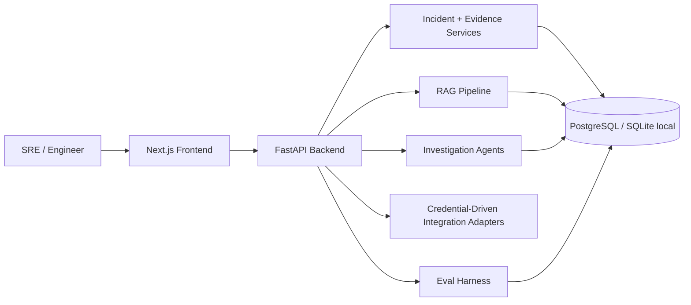

# Architecture

IncidentLens AI is a monorepo application with three major layers:

- frontend investigation surfaces
- backend incident and evidence services
- AI workflow, retrieval, and evaluation infrastructure

## High-Level Flow

## Backend Subsystems

### Incident Core

- incident CRUD
- evidence CRUD
- report persistence
- trace persistence

### Retrieval

- normalization
- chunking
- embedding generation
- pgvector-ready storage
- keyword fallback

### Agent Workflow

- Intake Agent
- Retrieval Agent
- Tool Execution Agent
- Root Cause Agent
- Remediation Agent
- Evaluation Agent

### Production Integrations

- GitHub
- Sentry
- Prometheus
- Statuspage
- runbook and historical incident knowledge

GitHub, Sentry, Prometheus, Statuspage, and runbook adapters fetch real provider data and fail closed when credentials or endpoints are missing. They remain separated from agent logic so providers can evolve without rewriting orchestration steps.

### Evaluation

- local dataset-backed runner
- persisted eval history
- dashboard surface for historical quality and failures

## Frontend Surfaces

- `/` dashboard
- `/incidents`
- `/incidents/[id]`
- `/incidents/[id]/trace`
- `/evidence`
- `/evals`
- `/settings`

## Runtime Notes

- the frontend exposes API failures through route error boundaries and never substitutes fixture data
- the backend routes structured requests through configured primary and fallback models
- the project venv is the intended local Python runtime

## Demo Story

The versioned payment-incident evaluation case is the quality anchor across:

- retrieval
- report generation
- trace rendering
- eval scoring
- integration-backed evidence import
