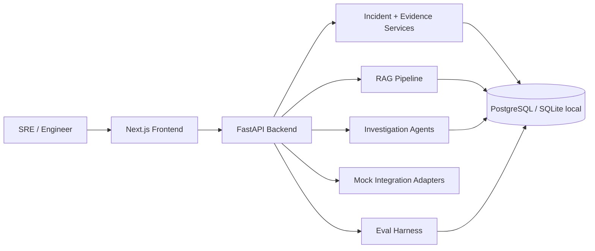

# Architecture

IncidentLens AI is a monorepo application with three major layers:

- frontend investigation surfaces
- backend incident and evidence services
- AI workflow, retrieval, and evaluation infrastructure

## High-Level Flow

## Backend Subsystems

### Incident Core

- incident CRUD
- evidence CRUD
- report persistence
- trace persistence

### Retrieval

- normalization
- chunking
- embedding generation
- pgvector-ready storage
- keyword fallback

### Agent Workflow

- Intake Agent
- Retrieval Agent
- Tool Execution Agent
- Root Cause Agent
- Remediation Agent
- Evaluation Agent

### Mock Integrations

- GitHub
- Sentry
- Prometheus
- Statuspage
- runbook and historical incident knowledge

These are intentionally separated from agent logic so later real adapters can be swapped in without rewriting orchestration steps.

### Evaluation

- local dataset-backed runner
- persisted eval history
- dashboard surface for historical quality and failures

## Frontend Surfaces

- `/` dashboard
- `/incidents`
- `/incidents/[id]`
- `/incidents/[id]/trace`
- `/evidence`
- `/evals`
- `/settings`

## Runtime Notes

- the frontend uses fast API timeouts and mock fallback paths so local demos stay responsive even if the backend is unavailable
- the backend uses deterministic mock model routing by default
- the project venv is the intended local Python runtime

## Demo Story

The seeded payment incident is the anchor scenario across:

- retrieval
- report generation
- trace rendering
- eval scoring
- integration-backed evidence import
