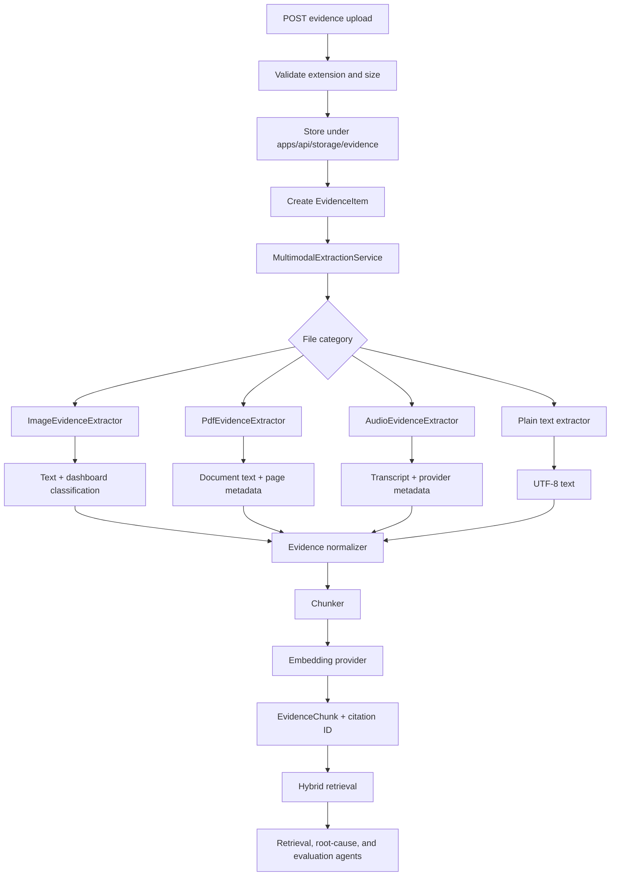

# Multimodal Evidence Design

Phase 7 extends the existing IncidentLens AI evidence pipeline. It does not create a separate multimodal index or agent path.

## Goals

- accept real incident files through the FastAPI API and Next.js UI
- convert screenshots, PDFs, voice notes, Markdown, and text files into normalized evidence
- preserve source-specific metadata such as dashboard classification, PDF page count, and transcript provider
- reuse the Phase 2 chunking, embedding, citation, and retrieval pipeline
- make multimodal evidence available to the Phase 3 agent workflow
- remain deterministic and fully usable in local mock mode

## Supported Evidence Types

| Category | Extensions | Source types |
| --- | --- | --- |
| Images | `.png`, `.jpg`, `.jpeg`, `.webp` | `screenshot`, `dashboard_screenshot`, `sentry_screenshot`, `architecture_diagram` |
| PDF | `.pdf` | `pdf_runbook`, `pdf_postmortem` |
| Audio | `.mp3`, `.wav`, `.m4a` | `voice_note` |
| Text | `.md`, `.txt` | `runbook`, `log` |

## Processing Flow



## API Contracts

### Upload

`POST /api/incidents/{incident_id}/evidence/upload`

Multipart fields:

- `file`: required upload
- `title`: optional evidence title
- `description`: optional context used by mock extraction
- `source_type`: optional explicit source type
- `process_immediately`: defaults to `true`

The response returns the persisted evidence item, processing result, and whether the file is uploaded or fully processed.

### File preview

`GET /api/evidence/{evidence_id}/file`

Only paths inside the configured evidence storage directory are allowed. Absolute paths and traversal attempts are rejected.

### Processing and retrieval

- `POST /api/evidence/{evidence_id}/process`
- `POST /api/incidents/{incident_id}/evidence/process-all`
- `POST /api/retrieval/search`

Retrieval filtering uses the existing `source_types` request field. Screenshot, PDF, and audio chunks carry extraction metadata into retrieval results.

## Extraction Result

Every extractor returns:

```json
{
  "extracted_text": "normalized source text",
  "summary": "short extraction summary",
  "detected_type": "dashboard_screenshot",
  "confidence": 0.88,
  "metadata": {},
  "warnings": []
}
```

Evidence metadata also tracks:

- original filename
- MIME type
- file size
- storage path
- extraction status
- extraction confidence
- extraction warnings
- dashboard classification where applicable

## Local Mock Providers

`MockImageExtractionProvider` interprets incident screenshots using filename and description signals. Grafana, Sentry, payment, latency, error, and release terms produce deterministic payment-incident evidence.

`DashboardScreenshotClassifier` classifies:

- `healthy`
- `degraded`
- `outage`
- `latency_spike`
- `error_spike`
- `resource_saturation`
- `unknown`

`MockAudioTranscriptionProvider` produces deterministic war-room transcripts without requiring Whisper or another large ASR model.

`PdfEvidenceExtractor` uses `pypdf` when available. Invalid, scanned, or otherwise unreadable PDFs return a non-crashing fallback with a warning.

## HuggingFace Task Coverage

- Image-to-Text: represented by the image extraction provider interface and mock implementation
- Image Classification: represented by dashboard screenshot classification
- Image-Text-to-Text: represented by incident-context visual interpretation
- Automatic Speech Recognition: represented by the audio transcription provider interface and mock implementation
- Visual Document Retrieval: extracted visual evidence is embedded and filtered by visual source type
- Document Question Answering: screenshot and PDF chunks are queried through the existing retrieval endpoint

Future adapters can replace the mock providers without changing evidence, RAG, retrieval, or agent contracts.

## Agent Behavior

The Retrieval Agent issues screenshot and voice-note queries in addition to the existing Sentry, GitHub, metrics, runbook, and prior-incident queries.

The Root Cause Agent dynamically uses available citation IDs instead of assuming fixed evidence numbering. Multimodal evidence increases confidence only when screenshot or audio evidence is actually present.

The Evaluation Agent checks that multimodal evidence has extracted content before treating related claims as supported.

The final report includes:

```markdown
### Multimodal Evidence
```

Each line includes the citation ID and source type so the frontend can render image, document, and transcript badges.

## Frontend Behavior

The upload panel supports drag and drop, file selection, progress, extraction state, processing state, embedding state, and extracted-text feedback.

Multimodal cards render:

- image preview or seeded visual placeholder
- PDF filename and page metadata
- audio controls for uploaded files
- dashboard classification and signals
- terminal-style extracted text
- chunk citation IDs
- latest-investigation usage state

## Verification

```bash
make seed
make test
```

Manual upload:

```bash
curl -X POST http://localhost:8000/api/incidents/1/evidence/upload \
  -F "file=@/absolute/path/to/grafana-payment-errors.png" \
  -F "process_immediately=true"
```

Manual retrieval:

```bash
curl -X POST http://localhost:8000/api/retrieval/search \
  -H "Content-Type: application/json" \
  -d '{
    "incident_id": 1,
    "query": "Which visual evidence supports the root cause?",
    "source_types": ["dashboard_screenshot", "sentry_screenshot"],
    "top_k": 8,
    "score_threshold": 0
  }'
```

Phase 8 portfolio polish and deployment work are intentionally not included in Phase 7.
